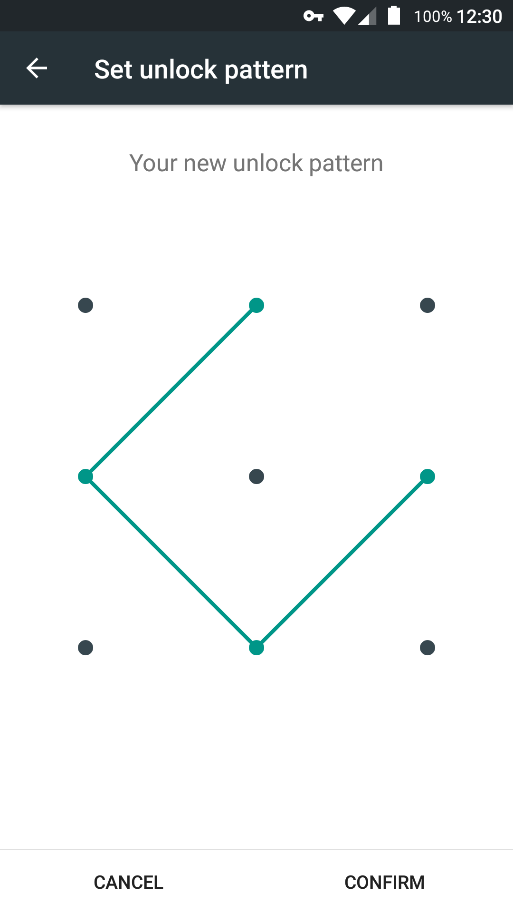
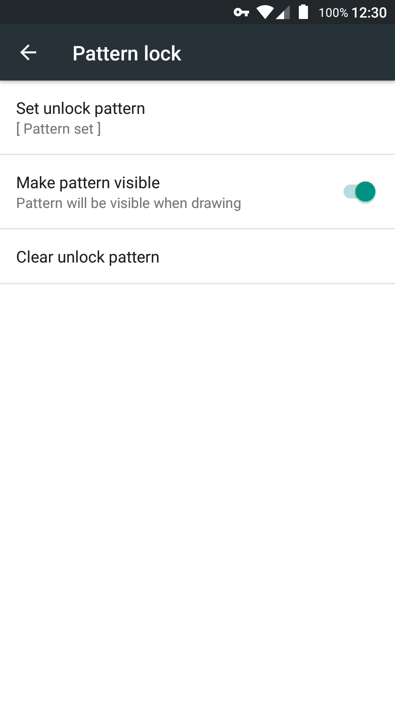

# PatternLock

A Material Design Pattern Lock library with auth flow implementation.

## Why PatterLock?

- Battle-tested framework implementation with necessary modifications.
- Supports XML attributes for customization.
- Supports variable MxN pattern size.
- Provides a drop-in implementation of the boilerplate create-and-confirm / verify flow, the same as the framework Settings app.
- Provides a detailed example of integration in sample app source, e.g. implementing protected UI, theme switching.

## Preview

<a href="https://play.google.com/store/apps/details?id=me.zhanghai.android.patternlock.sample2" target="_blank"></a>

[Sample APK](https://github.com/DreaminginCodeZH/PatternLock/releases/download/v2.1.2/sample-release.apk)

<p>


</p>

## Design

This library aims to provide the basic but extensible building blocks for implementing pattern lock mechanism in an Android app. So the common usage will be extending the base Activity classes provided and overriding methods according to your need.

This library also aims to be elegant. Code taken from AOSP was slightly refactored and renamed to be clear, and the `PatternView` now utilizes the Android resource system for customization.

This library added support for variable pattern sizes, so that you can use pattern sizes other than framework's hard-coded 3x3 setup by setting `app:pl_rowCount` and `app:pl_columnCount`.

## Integration

Gradle:

```gradle
compile 'me.zhanghai.android.patternlock:library:2.1.2'
```

## Usage

Here are some detailed usage documentation, and you can always refer to the sample app source for a working implementation.

### Styling

First of all, you need to include the default styling in your theme, by adding:

```xml
<item name="patternViewStyle">@style/PatternView</item>
<!-- Or PatternView.Light, or your own style extending these two or not. -->
```

Or you can utilize the resource overriding trick by copying the `layout/base_pattern_activity.xml` from the library source to your application source, and modify it there (for instance PatternView attributes). Changes will override the original layout in this library.

Available `PatternView` attributes are, as in `attrs.xml`:

```xml
<declare-styleable name="PatternView">
    <!-- Defines the row count of the pattern. -->
    <attr name="pl_rowCount" format="integer" />
    <!-- Defines the column count of the pattern. -->
    <attr name="pl_columnCount" format="integer" />
    <!-- Defines the aspect to use when drawing PatternView. -->
    <attr name="pl_aspect">
        <!-- Square; the default value. -->
        <enum name="square" value="0" />
        <enum name="lock_width" value="1" />
        <enum name="lock_height" value="2" />
    </attr>
    <!-- Defines the regular pattern color. -->
    <attr name="pl_regularColor" format="color|reference" />
    <!-- Defines the error color. -->
    <attr name="pl_errorColor" format="color|reference" />
    <!-- Defines the success color. -->
    <attr name="pl_successColor" format="color|reference"/>
</declare-styleable>
```

And built-in styles, as in `styles.xml`:

```xml
<style name="Base.PatternView" parent="">
    <item name="pl_rowCount">3</item>
    <item name="pl_columnCount">3</item>
    <item name="pl_aspect">square</item>
</style>

<style name="PatternView" parent="Base.PatternView">
    <item name="pl_regularColor">?colorControlNormal</item>
    <item name="pl_errorColor">#fff4511e</item>
    <item name="pl_successColor">?colorControlActivated</item>
</style>

<style name="PatternView.Light" parent="Base.PatternView">
    <item name="pl_regularColor">?colorControlNormal</item>
    <item name="pl_errorColor">#fff4511e</item>
    <item name="pl_successColor">?colorControlActivated</item>
</style>
```

### Implementing

As stated above, the common usage will be extending or checking result instead of giving `Intent` extras, because the actions to perform generally requires a `Context` or even a `Activity`, in which a simple callback can be difficult or even leaking `Activity` instances.

Set pattern activity example:

```java
public class SampleSetPatternActivity extends SetPatternActivity {

    @Override
    protected void onSetPattern(List<PatternView.Cell> pattern) {
        String patternSha1 = PatternUtils.patternToSha1String(pattern);
        // TODO: Save patternSha1 in SharedPreferences.
    }
}
```

Confirm pattern activity example:

```java
public class SampleConfirmPatternActivity extends ConfirmPatternActivity {

    @Override
    protected boolean isStealthModeEnabled() {
        // TODO: Return the value from SharedPreferences.
        return false;
    }

    @Override
    protected boolean isPatternCorrect(List<PatternView.Cell> pattern) {
        // TODO: Get saved pattern sha1.
        String patternSha1 = null;
        return TextUtils.equals(PatternUtils.patternToSha1String(pattern), patternSha1);
    }

    @Override
    protected void onForgotPassword() {

        startActivity(new Intent(this, YourResetPatternActivity.class));

        // Finish with RESULT_FORGOT_PASSWORD.
        super.onForgotPassword();
    }
}
```

Note that protected fields inherited from `BasePatternActivity`, such as `mMessageText` and `mPatternView`, are also there ready for your customization.

You can check out the sample app's [`PatternLockActivity`](sample/src/main/java/me/zhanghai/android/patternlock/sample/app/PatternLockActivity.java) for implementing a pattern-locked `Activity`.

## PatternLock or LockPattern?

The original view in AOSP is named `LockPatternView`, however I believe it is named so because it displays the (screen lock) pattern, instead of the pattern as a lock. Since this library is to provide the pattern as a locking mechanism, I'd prefer naming it `PatternLock`, and for simplicity， the view is renamed to `PatternView`.

## Differences with android-lockpattern

I know there is already a library named [android-lockpattern](https://code.google.com/p/android-lockpattern/), and I tried it for a whole day before I started writing this "yet another".

 So here are the major differences.

* That project is prefixing its resources using `alp_42447968`, while this project is prefixing its resources using `pl`, and I prefer simplicity to that "security".

* That project provides a bunch of mechanisms and extras for its `Activity` (and with some private methods :( ), none of which I found suitable for my use case, while this project provides a bunch of methods to override to meet your need.

* That project has a demo but it is close-sourced, while this project provides an open source sample application with a working pattern lock mechanism implementation.

## Legacy version

There was a legacy version of this library with Android Design (Holo) appearance and native Activity. If you still want that version, checkout [this](//github.com/DreaminginCodeZH/PatternLock/tree/0d82d0a1b5a01b7dcf206363012c339969c7a63d).

## License

    Copyright 2015 Zhang Hai

    Licensed under the Apache License, Version 2.0 (the "License");
    you may not use this file except in compliance with the License.
    You may obtain a copy of the License at

       http://www.apache.org/licenses/LICENSE-2.0

    Unless required by applicable law or agreed to in writing, software
    distributed under the License is distributed on an "AS IS" BASIS,
    WITHOUT WARRANTIES OR CONDITIONS OF ANY KIND, either express or implied.
    See the License for the specific language governing permissions and
    limitations under the License.
